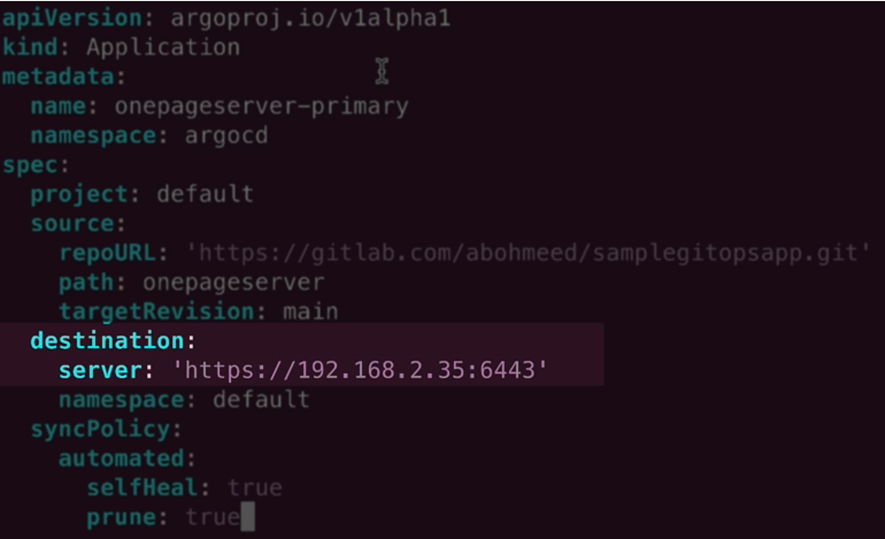
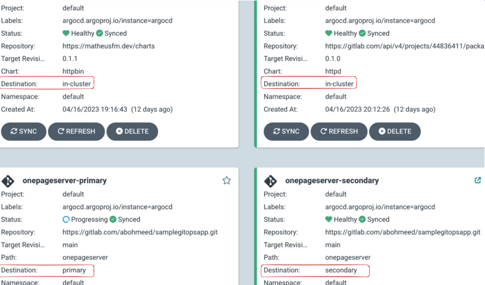
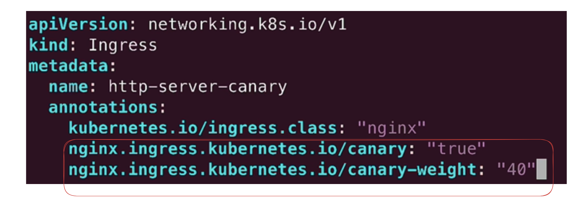
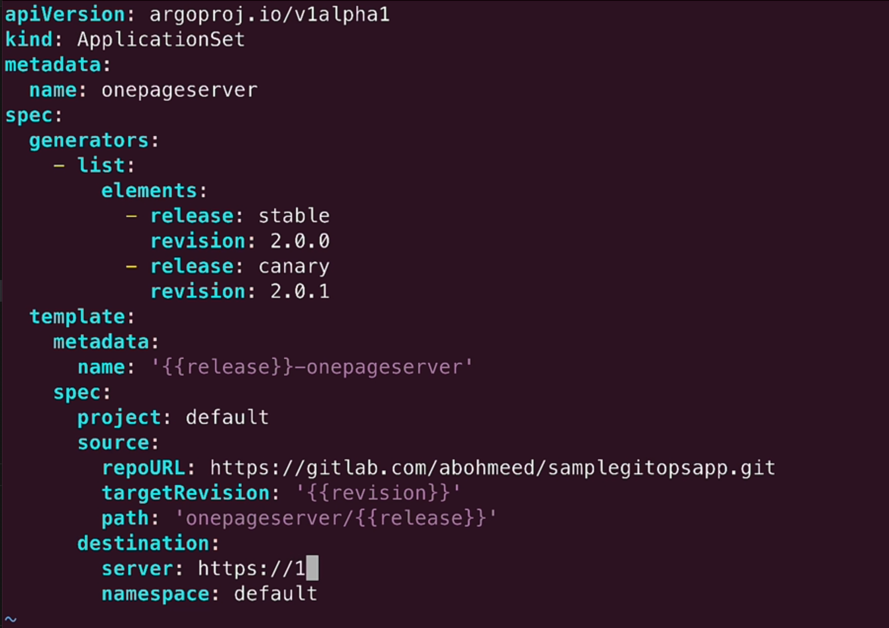

- Multicluster deployment
    - 3 k8s cluster, one has argocd running, another two we add using - 
    - argocd cluster add kind-primary --name primary --kubeconfig ./primary
    - argocd cluster add kind-primary --name secondary --kubeconfig ./secondary
    - create two applications, one primary , one secondary - 
    
    - Once extra field called destination that defines which k8s cluster it will be deployed! wow! Verify the destination fields - 
    
- Application Set:
    - two different application for two different clusters? Solution: ApplicationSet.
    - Argocd uses go template , so we can do if else in application set.
    
```
    apiVersion: argoproj.io/v1alpha1
kind: ApplicationSet
metadata:
  name: onepageserver
spec:
  generators:
    - list:
        elements:
          - cluster: production
            url: https://192.168.2.35:6443
            revision: main
          - cluster: development
            url: https://192.168.2.36:6443
            revision: dev
  template:
    metadata:
      name: '{{cluster}}-onepageserver'
    spec:
      project: default
      source:
        repoURL: https://gitlab.com/abohmeed/samplegitopsapp.git
        targetRevision: '{{revision}}'
        path: onepageserver
      destination:
        server: '{{url}}'
        namespace: default

```
    wow! we can also deploy the application to different namespaces! 

- Blue Green Deployent:
    - We can use applicationset to do blue green and use hot standby method. Very effective for highly sophisticated app.
    - We always need a LB or DNS switch to implement blue-green. The trick is in application set we point to different git tag, so simple.
- Canary Deployment:
    - It does not require two environments
    - We have two versions of the app, running together in the same cluster. Two folder => maps two versions of the app, stable and canary. We can use ingress object to split traffic between stable and canary versions.
    - Modify the ingress controller a bit 
    
    - update the application set
    
    - ??? manually change the ingress traffic split number and deploy ??? , update the git tags to point to the right commits. `Better to exclude the ingress from gitops and use a script to automacially patch traffic split and handle traffic routing`

- K8s limit is 150K pods!