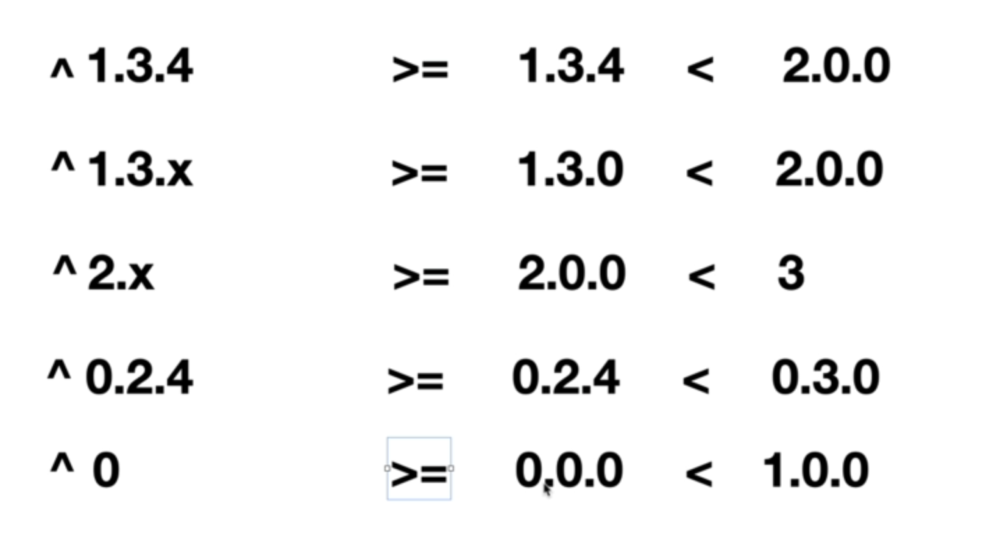
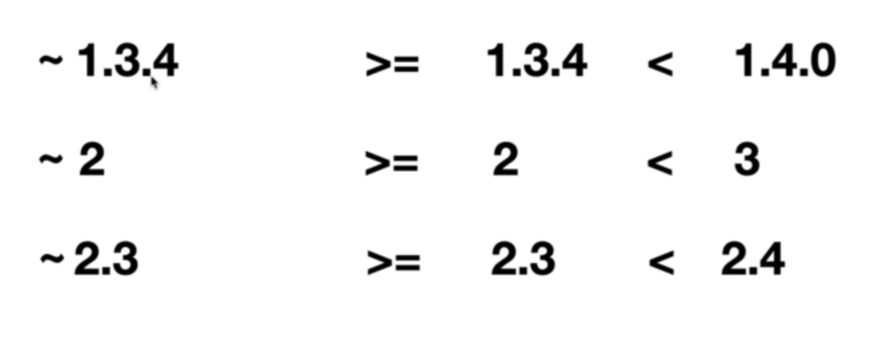

helm dependency --help
- build       rebuild the charts/ directory based on the Chart.lock file
- list        list the dependencies for the given chart
- update      update charts/ based on the contents of Chart.yaml

sadly there is no way to add dependency, we have t add them manually
- helm search repo mysql --versions | grep "bitnami/mysql"
- helm dependency update .
- helm dependency build .
- helm install --namespace practice product --create-namespace .
- kubectl get pods -n practice
- helm upgrade --namespace practice product .
- Can use a range for version supported operators: `>, >=, <, <= , ==, !=` and conjuction with `and , | , ^ , ~`
    - and : >= 11.1.14 and < 12.0.0
    - | : >=11.0.0 | >=12.0.0 (:p)
    - ^ : ^ means less than major version, with some catches
    
    - ~ works with minor version
    
    - with these sign, like other lock file, this uses the Chart.lock file
```
dependencies:
  - name: mysql
    version: ">= 11.1.14 and < 12.0.0"
    repository: https://charts.bitnami.com/bitnami
```

- add dependancy conditionally:
in values.yml put this
```
mysql:
  enabled: false
```
and in Chart.yml following change - 
```

dependencies:
  - name: mysql
    version: "11.1.14"
    repository: https://charts.bitnami.com/bitnami
    condition: mysql.enabled <--------------------------------- CHANGE ( use it as it is , not via .Values ****** VVVI)
```
- careful : if the tag deos not exist it resolves to true by default not false!
- We had to uninstall and install when dependecies change.
- We can also use tags. Tags and conditions allow you to turn on and off dependencies as they are installed. 
- helm uninstall product -n practice
- helm dependency update .
- helm dependency build .
- helm install --namespace practice product .
- kubectl get pods -n practice
- kubectl get pvc -n practice

- pass value to dependancy from the main chart / override dependant chart value from main chart
    - create a yaml key with the name of the dependancy
    - then put the config under that.
- read value from dependant chart
    - `explicit import`: If the dependant chart library (mysql in our case), in it's values.yml file there is a export section like this - 
    ```
    export:
        service:
            port: 8080
    ```
    then in our Charts.yml we can export the keys under import-values section of the corresponding dependancy.
    ```
    dependencies:
  - name: mysql
    version: "11.1.14"
    repository: https://charts.bitnami.com/bitnami
    # condition: mysql.enabled
    tags:
      - enabled
    import-values: < -------------------------------------- explicit import
      - service
    ```
    And then use it in our chart like .Values.service.port ( but what if we have the same key in our chart!!! - I don't know!)

    - `implicit import`
        - test: {{.Values.mySqlChartImage.pullPolicy}} 
        - import-values:
            - child: image < -------------------------------- the value that is coming from Values.yml of the dependant char (VVI ***** , only can inport(refer to) from values.yml)
              parent: mySqlChartImage < --- more like an alias!

- Hook: 
    - 