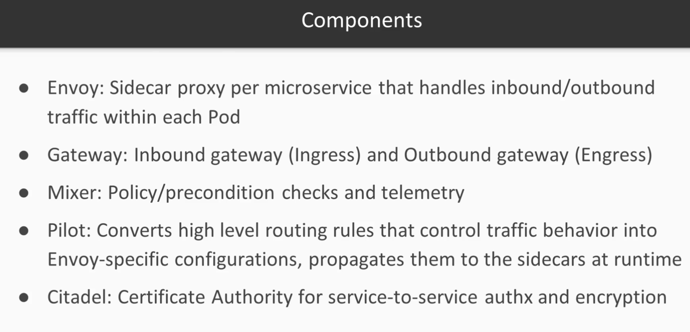

# Course outline:
- Traffic management
- Service resilience
- Chaos Testing
- Securing the mesh
- Diagnosability

# Architecture:

- Summary: Traffic enters into the mesh via Ingress Gateway, leaves mesh via Egress Gateway(to talk to external components)
- Envoy on steroid.
## Traffic routing components:

## Installation:
- kubectl cluster-info
- kubectl get crd | grep 'istio.io' | wc -l
- gcloud container clusters update gke01 --region asia-southeast1 --project cool-furnace-431504-e1 --workload-policies=allow-net-admin 

# Note:
- kubectl describe  pod istio-ingressgateway-68b4f7f7cb-9dzcv  -n istio-system | grep 'Labels:' -A 5 and ensure istio=ingressgateway label is there(which is there by default helm installation of istio gateway). We have to use it in the Kind: Gateway object as selector. Same gateway objects can be used for different domains.
# Test:
- kubectl create ns istio-demo
- kubectl label ns istio-demo istio-injection=enabled --overwrite
- deploy the app using argocd
- The load balancer is created at this phase since we isntall istio gatway using helm (Not then we define gateway object)
- kubectl get svc -n istio-system
- curl -H "Host: nginx-app.demo" 34.87.168.112 <WOW!!! I actually got it right in the first place the whole istio arch!>