- get the external ip of the lb 
- kubectl get svc -n istio-system or better kubectl get svc istio-ingressgateway  -n istio-system
- note the external ip
- kubectl get svc istio-ingressgateway  -n istio-system -o jsonpath='{}'   `Get the full json`
- use chrome devtool to find the ip , ctrl + F -> paste external ip, then right click and use copy property path `status.loadBalancer.ingress[0].ip`
- kubectl get svc istio-ingressgateway  -n istio-system -o jsonpath='{.status.loadBalancer.ingress[0].ip}' 
- Deploy the payment service with argocd
- kubectl get svc istio-ingressgateway  -n istio-system -o jsonpath='{.status.loadBalancer.ingress[0].ip}'
- curl -H "Host: payment-service.cloud" 34.87.168.112
- kubectl apply -f /Users/mdnajimahmed/Documents/LocalSystem/istio/2.traffic-management/debug.yml
- kubectl exec -it mole -- /bin/sh
- add `34.87.168.112 payment-service.cloud` to /etc/hosts file and hit payment-service.cloud few times to see it returns both blue and green!

- This gateway configuration lets HTTPS traffic from ext-host.example.com into the mesh on port 443, but doesn’t specify any routing for the traffic.

- To specify routing and for the gateway to work as intended, you must also bind the gateway to a virtual service. You do this using the virtual service’s gateways field.

- you have to install `istio-egressgateway` using helm!, does not automatically come. Once you should do it, you should see new pods(and a service as well) with this label in istio-system. `Todo: Yet to verify if it installs anything in the cluster like istio ingress installed a LB` 

# Path based routing
- curl payment-service.cloud/api/version `along with the host entry in the test machine`
- curl payment-service.cloud/api/v1/version
- curl payment-service.cloud/api/v2/version

# Header based routing
- Chrome users should see the blue site whereas other users should see the green site
- A list does OR, same element does AND.
- Hit http://payment-service.cloud/index.html from chrome you should see blue ( given the host entry is done in your local)
- Hit http://payment-service.cloud/index.html from any other browser you should see green
- Reality!
Edge!
    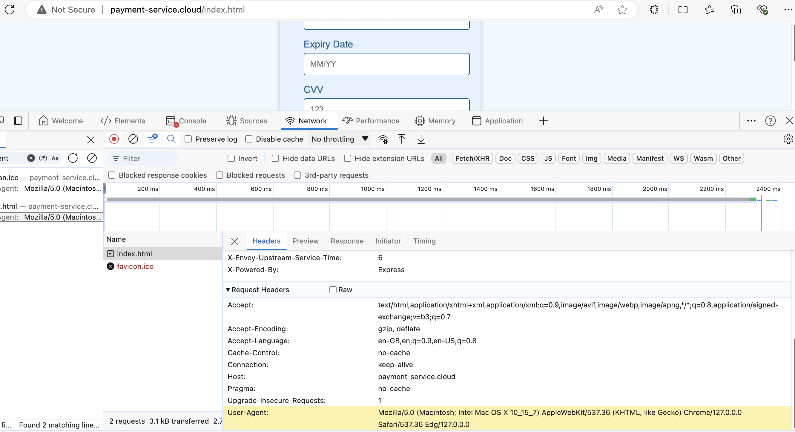
Chrome
    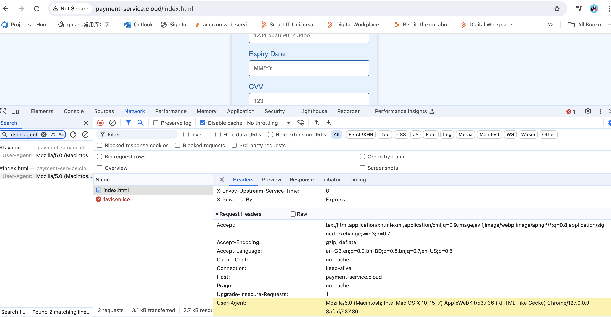
Firefox
    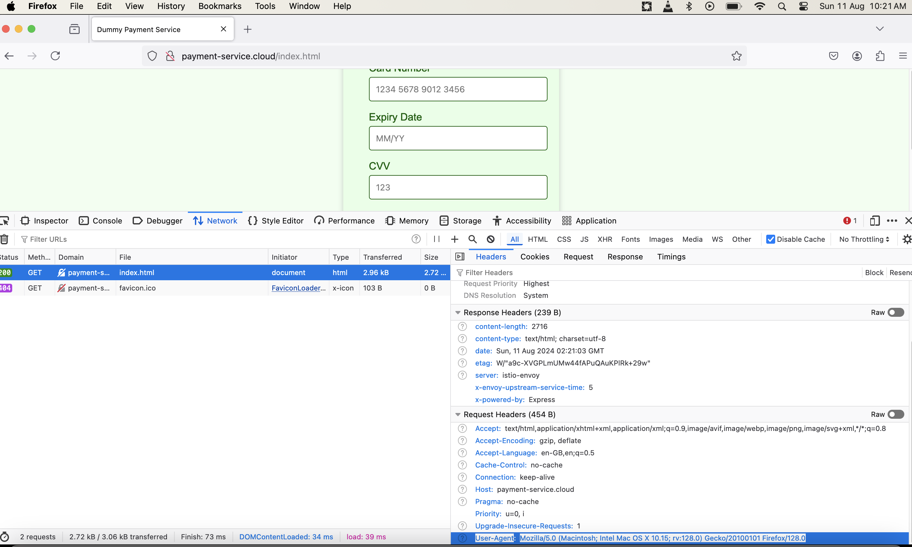
Safari
    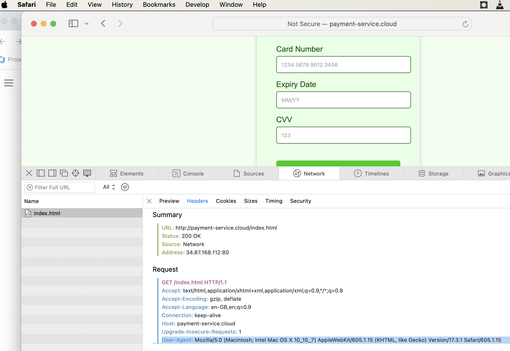
- We can also use cookie header to do intelligent routing e.g AB teting

# Weight based routing
- http://payment-service.cloud/weight-based-routing.html - keep trying this, will render green
- ./weight-base-routing-test.sh http://payment-service.cloud/weight-based-routing.html
    Application Version 1.0.1 found 16 times
    Application Version 1.0.0 found 84 times

# Deployment patterns:
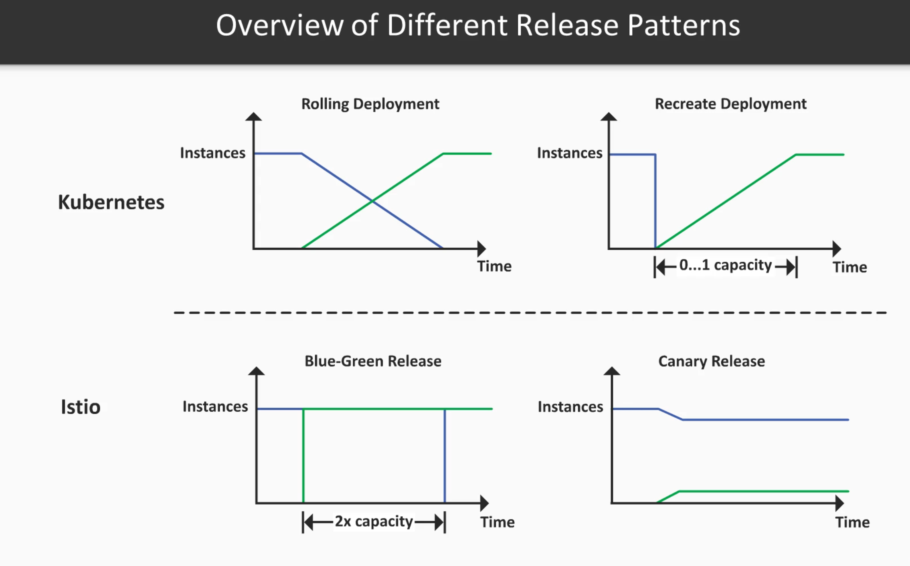
- blue green , route traffic to one subset, canary route traffic to both subsets but with weight - as simple as that. `The both can run with HPA`
- 

# Official doc notes - 
- Virtual services, along with destination rules, are the key building blocks of Istio’s traffic routing functionality. 
- With a virtual service, you can specify traffic behavior for one or more hostnames. You use routing rules in the virtual service that tell Envoy how to send the virtual service’s traffic to appropriate destinations. Route destinations can be different versions of the same service or entirely different services.
- Destination rules are where you specify your service subsets.
- Using short names like this only works if the destination hosts and the virtual service are actually in the same Kubernetes namespace. Because using the Kubernetes short name can result in misconfigurations, we recommend that you specify fully qualified host names in production environments.
- Routing rules are evaluated in sequential order from top to bottom, with the first rule in the virtual service definition being given highest priority. In this case you want anything that doesn’t match the first routing rule to go to a default destination, specified in the second rule. Because of this, the second rule has no match conditions and just directs traffic to the v3 subset.

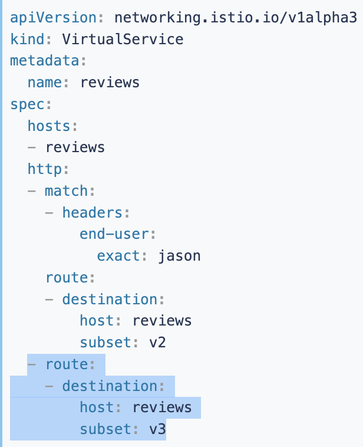

- We recommend providing a default “no condition” or weight-based rule (described below) like this as the last rule in each virtual service to ensure that traffic to the virtual service always has at least one matching route.
- You can add multiple match conditions to the same match block to AND your conditions, or add multiple match blocks to the same rule to OR your conditions.
- You can also use routing rules to perform some actions on the traffic, for example:
    - Append or remove headers.
    - Rewrite the URL.
    - Set a retry policy for calls to this destination.

- You can think of virtual services as how you route your traffic to a given destination, and then you use destination rules to configure what happens to traffic for that destination. Destination rules are applied after virtual service routing rules are evaluated, so they apply to the traffic’s “real” destination.
- By default, Istio uses a least requests load balancing policy, where requests are distributed among the instances with the least number of requests.

- You use a gateway to manage inbound and outbound traffic for your mesh, letting you specify which traffic you want to enter or leave the mesh. Gateway configurations are applied to standalone Envoy proxies that are running at the edge of the mesh, rather than sidecar Envoy proxies running alongside your service workloads.

-  Istio’s Gateway resource just lets you configure layer 4-6 load balancing properties such as ports to expose, TLS settings, and so on. 
- 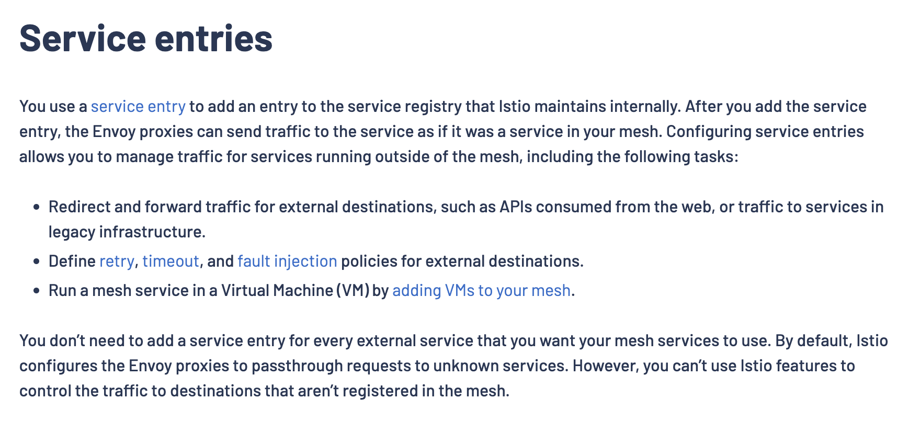
- 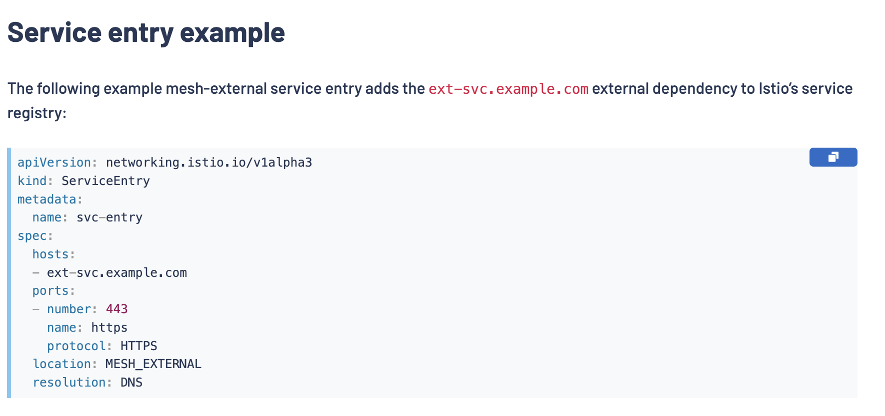
- You can configure virtual services and destination rules to control traffic to a service entry in a more granular way, in the same way you configure traffic for any other service in the mesh.
- 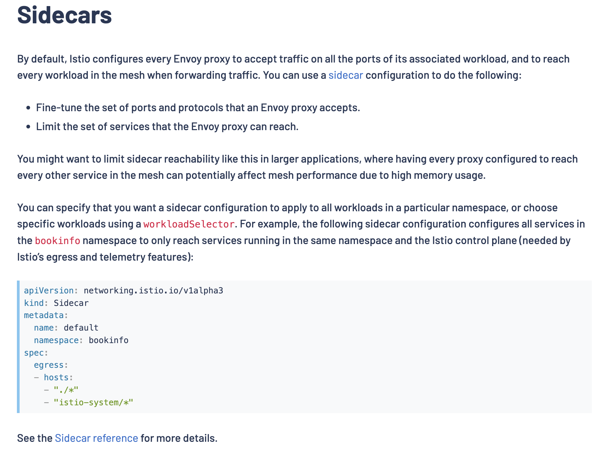
- The Envoy timeout for HTTP requests is disabled in Istio by default.
-  Retries can enhance service availability and application performance by making sure that calls don’t fail permanently because of transient problems such as a temporarily overloaded service or network. 
- The interval between retries (25ms+) is variable and determined automatically by Istio, preventing the called service from being overwhelmed with requests. The default retry behavior for HTTP requests is to retry twice before returning the error.
- 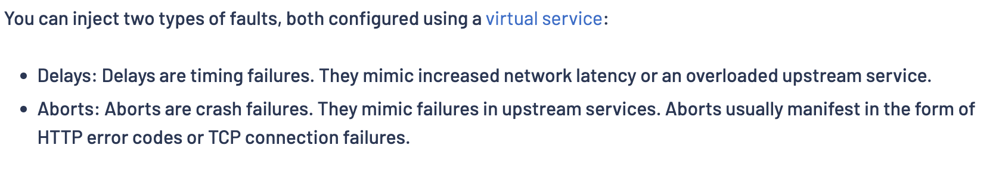

# Test egress:
- 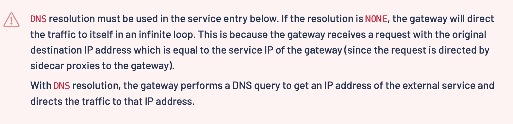
- kubectl get pod -l istio=egressgateway -n istio-system
- kubectl apply -f debug.yml
- kubectl exec mole  -n istio-demo -- curl -s https://jsonplaceholder.typicode.com/todos/1
- kubectl get configmap istio -n istio-system -o yaml | grep -o "mode: "
- kubectl get configmap istio -n istio-system -o yaml | grep -o "mode: ALLOW_ANY"
- kubectl describe cm istio -n istio-system | grep 'argocd.argoproj.io/instance=' `it's installed by istiod`

**Nothing seems to be working to outboundTrafficPolicy set to REGISTRY_ONLY, again helm showing it's ass (or rather open source helm charts showing their ass). Moving on with other lessons. Next time may be try istioctl to install install instead of helm as per documentation(which I don't like because it's not IAC/GitOps - on the other hand it's Infa - so palybook might be acceptable along with the other commands to create a k8s clsuter!)** 

UPD: I found the root cause, the pod did not have namespace define, hence was deployed in default namespace which is outside of the mesh. hence the rule was not applied.
