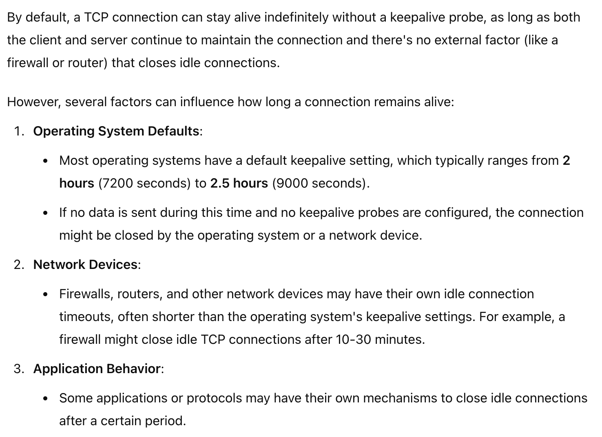
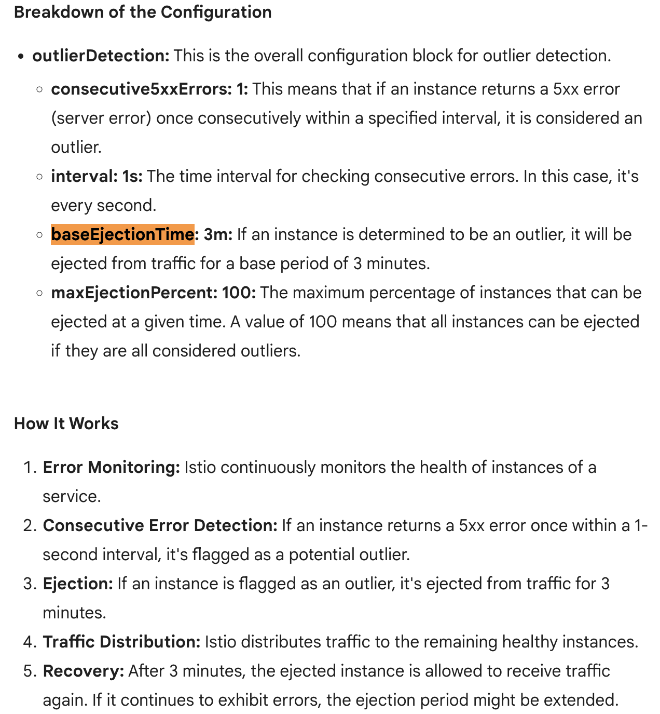

# Istio Circuit Breaking Capabilities 

## 1. Connection Pool Limits

**Purpose**: Controls the number of connections to a service to prevent overloading it.

**Key Parameters**:
- `maxConnections`: Maximum number of connections to the service.
- `connectTimeout`: Time to wait for a connection before timing out.
- `tcpKeepalive`: Configuration for keeping TCP connections alive. 
    - https://www.youtube.com/watch?v=j8lgFaIajko
    - https://www.youtube.com/watch?v=jZdY9qpeVOI
    - https://tldp.org/HOWTO/TCP-Keepalive-HOWTO/overview.html
    - 

**Example**:
```yaml
apiVersion: networking.istio.io/v1alpha3
kind: DestinationRule
metadata:
  name: my-service-destination
spec:
  host: my-service
  trafficPolicy:
    connectionPool:
      tcp:
        maxConnections: 100
        connectTimeout: 10s
        tcpKeepalive:
          time: 7200s
          interval: 75s
```

**Explanation**:
- `maxConnections: 100` limits the number of simultaneous TCP connections to `my-service` to 100.
- `connectTimeout: 10s` sets a 10-second timeout for establishing new connections.
- `tcpKeepalive` ensures that the TCP connection remains alive with periodic keepalive probes.

## 2. Outlier Detection

**Purpose**: Identifies and ejects unhealthy service instances from the load balancer pool.

**Key Parameters**:
- `consecutiveErrors`: Number of consecutive errors before marking an instance as unhealthy.
- `interval`: Time between health checks.
- `baseEjectionTime`: Time to eject an unhealthy instance.
- `maxEjectionPercent`: Maximum percentage of instances that can be ejected.

**Example**:
```yaml
apiVersion: networking.istio.io/v1alpha3
kind: DestinationRule
metadata:
  name: my-service-destination
spec:
  host: my-service
  trafficPolicy:
    outlierDetection:
      consecutiveErrors: 5
      interval: 10s
      baseEjectionTime: 30s
      maxEjectionPercent: 50
```

**Explanation**:
- `consecutiveErrors: 5` ejects an instance if it returns 5 consecutive errors.
- `interval: 10s` performs health checks every 10 seconds.
- `baseEjectionTime: 30s` keeps the ejected instance out of the pool for 30 seconds before reconsidering it.
- `maxEjectionPercent: 50` ensures that no more than 50% of instances are ejected at any time.

## 3. Max Requests Per Connection

**Purpose**: Limits the number of requests sent over a single connection to a service.

**Key Parameter**:
- `maxRequestsPerConnection`: Maximum number of requests per connection.

**Example**:
```yaml
apiVersion: networking.istio.io/v1alpha3
kind: DestinationRule
metadata:
  name: my-service-destination
spec:
  host: my-service
  trafficPolicy:
    connectionPool:
      http:
        maxRequestsPerConnection: 10
```

**Explanation**:
- `maxRequestsPerConnection: 10` closes a connection after 10 requests have been made, forcing a new connection to be opened for subsequent requests.

## 4. Max Pending Requests

**Purpose**: Limits the number of requests that can be pending (queued) before being sent to the service.

**Key Parameter**:
- `http1MaxPendingRequests`: Maximum number of pending requests for HTTP/1 connections.

**Example**:
```yaml
apiVersion: networking.istio.io/v1alpha3
kind: DestinationRule
metadata:
  name: my-service-destination
spec:
  host: my-service
  trafficPolicy:
    connectionPool:
      http:
        http1MaxPendingRequests: 20
```

**Explanation**:
- `http1MaxPendingRequests: 20` allows up to 20 requests to be queued for `my-service`. If more requests arrive, they will be rejected or retried.

## 5. Max Requests

**Purpose**: Limits the total number of requests that can be outstanding (in progress) to a service.

**Key Parameter**:
- `maxRequests`: Maximum number of outstanding requests.

**Example**:
```yaml
apiVersion: networking.istio.io/v1alpha3
kind: DestinationRule
metadata:
  name: my-service-destination
spec:
  host: my-service
  trafficPolicy:
    connectionPool:
      http:
        maxRequests: 100
```

**Explanation**:
- `maxRequests: 100` limits the total number of in-progress requests to `my-service` to 100. Any additional requests will be queued or rejected.

## 6. Retries

**Purpose**: Configures retry policies for requests to a service, specifying how many times to retry, how long to wait between retries, and under what conditions.

**Key Parameters**:
- `attempts`: Number of retry attempts.
- `perTryTimeout`: Timeout for each retry attempt.
- `retryOn`: Conditions under which retries are triggered (e.g., `5xx`, `gateway-error`).

**Example**:
```yaml
apiVersion: networking.istio.io/v1alpha3
kind: VirtualService
metadata:
  name: my-service-virtualservice
spec:
  hosts:
  - my-service
  http:
  - route:
    - destination:
        host: my-service
    retries:
      attempts: 3
      perTryTimeout: 2s
      retryOn: gateway-error,5xx
```

**Explanation**:
- `attempts: 3` retries the request up to 3 times if the conditions are met.
- `perTryTimeout: 2s` gives each retry attempt 2 seconds before it times out.
- `retryOn: gateway-error,5xx` triggers retries for gateway errors and server errors (HTTP 5xx).


# Sample
```
apiVersion: networking.istio.io/v1alpha3
kind: DestinationRule
metadata:
  name: my-destination-rule
spec:
  host: my-service.default.svc.cluster.local   

  trafficPolicy:
    loadBalancer:
      simple: ROUND_ROBIN  # Options: ROUND_ROBIN, LEAST_CONN, RANDOM
      consistentHash:  # Choose one of these options
        httpHeaderName: "X-My-Header"  # For consistent hashing
#        httpCookie:
#          name: "my-cookie"  # For cookie-based consistent hashing (optional)
#          ttl: 1h  # Time-to-live for the cookie (optional)
    connectionPool:
      tcp:
        maxConnections: 1000
        connectTimeout: 10s
        idleTimeout: 1m
        maxPendingRequests: 1000
        tcpKeepalive:
          time: 7200s  # Time to keep an idle connection alive
          interval: 75s  # Interval between keep-alive probes
      http:
        maxConnections: 1000
        connectTimeout: 30s
        idleTimeout: 1m
        maxRequestsPerConnection: 1000  # Optional, define retries
        maxRetries: 3  # Optional, define retries
        headers:
          add:
            X-Custom-Header: "value"  # Optional, add custom headers
    tls:
      mode: SIMPLE  # Options: SIMPLE, MUTUAL, DISABLE
# Choose one of these options
      clientCertificate:  
        certificate:
          file: /path/to/cert.pem
        privateKey:
          file: /path/to/key.pem
# OR
#      certificate:
#        file: /path/to/certificate.pem
#      privateKey:
#        file: /path/to/privatekey.pem
      caCertificates:
        file: /path/to/ca-cert.pem  # Optional for mutual TLS
      sni: "example.com"  # Optional for SNI routing
    outlierDetection:
      consecutive5xxErrors: 5
      interval: 10s
      baseEjectionDuration: 30s
      maxEjectionPercent: 50
      maxRequestsPerConnection: 1000  # Optional, define max requests per connection
      ejectionTime: 60s  # Optional, specifies how long a host is ejected
    portLevelSettings:  # Optional, settings for specific ports
      - port:
          number: 8080
        tls:
          mode: SIMPLE
        connectionPool:
          http:
            maxRequestsPerConnection: 200
    subsets:  # Optional, for defining subsets of the service
      - name: v1
        labels:
          version: v1
      - name: v2
        labels:
          version: v2
```

# Top 5 most common istio curcuit breaking usecases with example
- Preventing Overload of a Service
`Use Case`: Protecting a service from being overwhelmed by too many requests.
`Example`: Suppose you have a payment service that’s prone to high traffic spikes. You can configure a circuit breaker to limit the number of concurrent requests to this service. If the number of requests exceeds a certain threshold, Istio will stop sending additional requests to it until the load decreases.
```
apiVersion: networking.istio.io/v1alpha1
kind: DestinationRule
metadata:
  name: payment-service-circuit-breaker
spec:
  host: payment-service
  trafficPolicy:
    connectionPool:
      tcp:
        maxConnections: 100
    outlierDetection:
      consecutive5xxErrors: 5
      interval: 1m
      baseEjectionTime: 30s
      maxEjectionPercent: 50

```
- Handling High Latency
`Use Case`: Managing responses from services that are slow to respond.
`Example`: If you have a service that’s experiencing high latency, you can configure a circuit breaker to detect slow responses and avoid routing traffic to it while it recovers.
```
apiVersion: networking.istio.io/v1alpha1
kind: DestinationRule
metadata:
  name: latency-circuit-breaker
spec:
  host: slow-service
  trafficPolicy:
    connectionPool:
      tcp:
        maxConnections: 100
    outlierDetection:
      interval: 1m
      baseEjectionTime: 1m
      maxEjectionPercent: 50
      consecutiveGatewayErrors: 5
      http:
        http1:
          maxRequestsPerConnection: 100
        http2:
          maxRequestsPerConnection: 100
```
- Mitigating Service Failures
Use Case: Recovering from failures in a dependent service.
Example: If your front-end service relies on a user profile service, and this service starts failing, you can use circuit breaking to stop sending traffic to the failing service until it stabilizes.
```
apiVersion: networking.istio.io/v1alpha1
kind: DestinationRule
metadata:
  name: user-profile-circuit-breaker
spec:
  host: user-profile-service
  trafficPolicy:
    outlierDetection:
      consecutive5xxErrors: 5
      interval: 1m
      baseEjectionTime: 1m
      maxEjectionPercent: 100
```
- Managing Resource Limits
Use Case: Controlling resource usage to avoid hitting limits.
Example: If a service is limited by resources like CPU or memory, you can configure circuit breaking to prevent it from being overwhelmed.
```
apiVersion: networking.istio.io/v1alpha1
kind: DestinationRule
metadata:
  name: resource-limit-circuit-breaker
spec:
  host: resource-limited-service
  trafficPolicy:
    connectionPool:
      http:
        maxRequestsPerConnection: 10
        maxConnections: 50

```
- Protecting Against External Dependencies
Use Case: Safeguarding services that depend on external APIs or third-party services.
Example: If your service calls an external payment gateway that occasionally fails, configure a circuit breaker to avoid retries during failures.
```
apiVersion: networking.istio.io/v1alpha1
kind: DestinationRule
metadata:
  name: external-api-circuit-breaker
spec:
  host: external-api-service
  trafficPolicy:
    outlierDetection:
      consecutive5xxErrors: 3
      interval: 30s
      baseEjectionTime: 1m
      maxEjectionPercent: 50
```
# Hands on scenarios
- from the documentation - https://istio.io/latest/docs/tasks/traffic-management/circuit-breaking/ combining with my favourite - fallback to secondary service while primary is down, resume routing to primary once it is up again.
- we will add a new API in the previous payment microservice, this api will simulate failure that lasts about 1 minute. So if the api will be down if current-time-minute%5 == 0, it remains down for 1 minute in every minutes!!! And when it remains down, secondary service picks up the request and processes the request.
- How outlier detection works

- kubectl exec mole  -n istio-demo -- curl -s http://payment-microservice/api/message
- curl payment-service.cloud/api/message
- verified if circuit open it does not send request.
- 