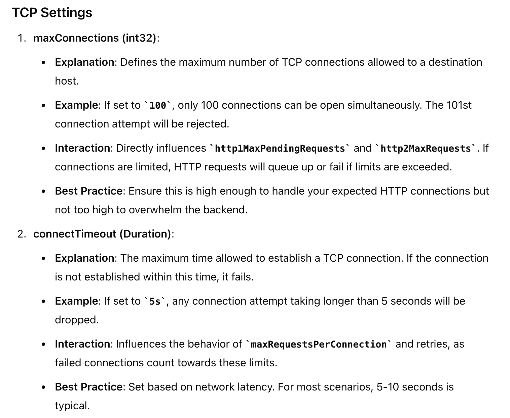
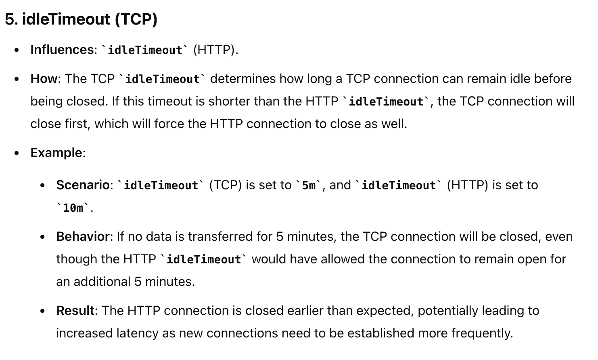

# Theory







# Sample
```
trafficPolicy:
    connectionPool:
      tcp:
        maxConnections: 100
        connectTimeout: 5s
        tcpKeepalive:
          interval: 30s
          timeout: 10s
        maxConnectionDuration: 1h
        idleTimeout: 10m
      http:
        http1MaxPendingRequests: 10
        http2MaxRequests: 100
        maxRequestsPerConnection: 0  # Unlimited requests per connection
        maxRetries: 3
        idleTimeout: 10m
```

Here tcp settings are used , and https settings are used only to close gap that tcp settings does not offer(not tcp layers concern)


