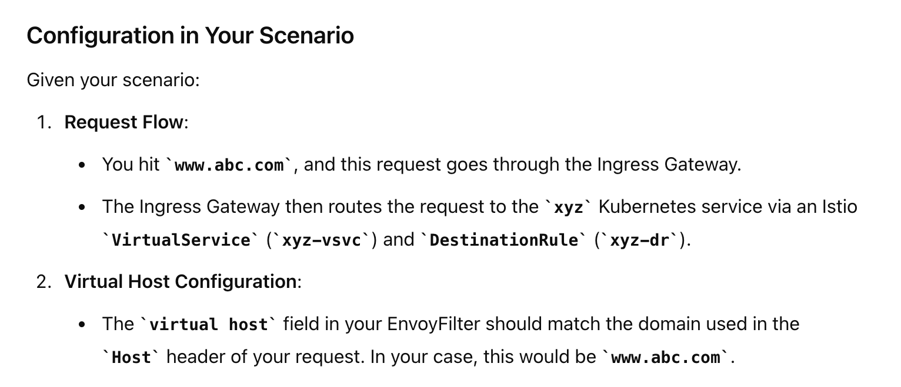

- update istiod config map with following values - 
```
mixer:
    policy:
        enabled: true
global:
    disablePolicyChecks: false
```
- kubectl rollout restart deployment istiod -n istio-system
- Note: With istio helm and argocd, for some reason we have to delete the argocd app to update configmap!
- kubectl -n istio-system get cm istio -o jsonpath="{@.data.mesh}" | grep disablePolicyChecks
- Now we already know that in a mesh on N pods there are N+2 envoy proxies, 1 ingress gateway, 1 egress gateway,
N sidecars. So we can theoritically put ratelimiting on each of them. The one we put on ingress gateway will limit overall traffic into the mesh wheras , the local envoy proxies mostly for internal traffic handling.

- Envoy supports two kinds of rate limiting: global and local. Global rate limiting uses a global gRPC rate limiting service to provide rate limiting for the entire mesh. Local rate limiting is used to limit the rate of requests per service instance. Local rate limiting can be used in conjunction with global rate limiting to reduce load on the global rate limiting service.

- Global rate limiting
    - Per connection (l4) : filter: type.googleapis.com/envoy.extensions.filters.network.ratelimit.v3.RateLimit
    - per HTTP request (l7) : filter: type.googleapis.com/envoy.extensions.filters.http.ratelimit.v3.RateLimit
- Local rate limiting
    -  l4
        - local rate limit listener filter : type.googleapis.com/envoy.extensions.filters.listener.local_ratelimit.v3.LocalRateLimit(processes the sockets before TLS handshake and filter chain matching)
        - local rate limit network filter : type.googleapis.com/envoy.extensions.filters.network.local_ratelimit.v3.LocalRateLimit
    - l7
        - type.googleapis.com/envoy.extensions.filters.http.local_ratelimit.v3.LocalRateLimit

- [From official Doc]Although distributed circuit breaking is generally extremely effective in controlling throughput in distributed systems, there are times when it is not very effective and global rate limiting is desired. The most common case is when a large number of hosts are forwarding to a small number of hosts and the average request latency is low (e.g., connections/requests to a database server). If the target hosts become backed up, the downstream hosts will overwhelm the upstream cluster. In this scenario it is extremely difficult to configure a tight enough circuit breaking limit on each downstream host such that the system will operate normally during typical request patterns but still prevent cascading failure when the system starts to fail. Global rate limiting is a good solution for this case.

- In Istio and Envoy, the term "virtual host" refers to a configuration element within Envoy that matches requests based on their Host header. 
- Virtual Host: A virtual host in Envoy is essentially a set of routing rules for a specific domain or set of domains. It is used to match incoming requests based on the Host header and route them accordingly.
- 
- route.action: ANY: Applies to all routes.`DIRECT,REDIRECT,REWRITE`

# Moment of truth 01: 
- Task 01: Apply rate limit to all path /api/version under host payment-service.cloud
    - 1 api call per minute, user will be identified by Authorization Header
    - But in mesh communication should allow 1 api call per 30 second per user, user will be identified by Authorization Header (local rate limiter)

# Lesson learn:
- Unexpected Leaky abstraction from istio, have to directly understand envoy to implement rate limiting.
- Some other day we will explore envoy proxy and understand all the config param better. For now resuming istio...